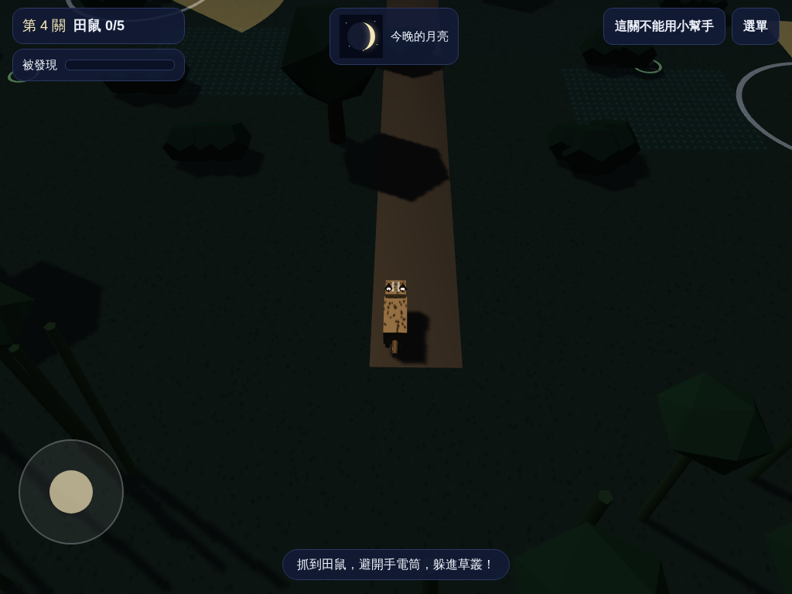

# 石虎月夜行 Leopard Cat Moon Night

臺灣國小四年級自然「月亮」單元的 3D 複習遊戲。學生扮演臺灣保育類動物**石虎**，要先看懂月相、推算出**最暗的夜晚**，再避開巡田農夫的手電筒，到田裡抓田鼠。

**線上遊玩：** https://prayer168.github.io/leopard-cat-moon-night/


## 適用對象

- 國小四年級自然科「月亮」單元，對應 108 課綱
- 課後複習或課堂分組活動
- 學生用平板（iPad）、Chromebook 或筆電開啟網址即可，不需要登入，也不收集任何個人資料

## 五個關卡

| 關卡 | 名稱 | 學習重點 |
|---|---|---|
| 1 | 收集月相卡片 | 月相變化的順序（新月到殘月），週期約 29.5 天 |
| 2 | 看月亮，找新月 | 從月相圖推算新月是哪一天（每階段約 7 天） |
| 3 | 看農曆，找新月 | 月相與農曆日期的對應：初一新月、十五滿月 |
| 4 | 上弦？下弦？ | 分辨右邊亮（漸盈）和左邊亮（漸虧），不能用小幫手 |
| 5 | 月亮什麼時候出來 | 不同月相升起的時間不同，選出最暗的出門時段 |

全部過關後有「月相總複習」。遊戲中可隨時打開「月相小幫手」，拖曳月亮繞地球轉，觀察從臺灣看到的月相變化（第 4 關除外）。


## 遊戲設計重點

- **科學概念就是遊戲機制**：月光亮度決定農夫看得多遠（白色圓圈）。選錯日子，月光變亮，很容易被發現。
- **針對常見迷思回饋**：把下弦月看成上弦月、以為滿月後很快就是新月、以為月相是地球影子造成的。
- **科學正確**：月相依北半球（臺灣）方向繪製，亮部比例 illum = (1 - cos θ) / 2；新月時天空中不畫月亮。
- **石虎特徵**：額頭兩條白色縱紋、耳後白斑。石虎是肉食動物，所以任務是抓田鼠，不是偷水果。



## 操作方式

- 筆電：方向鍵或 W A S D
- 平板：左下角虛擬搖桿
- 躲進草叢可以擋住月光，也能擋住大部分手電筒的光

## 檔案結構

```
index.html          部署用的完整網頁（由 tools/build.sh 產生）
game.html           遊戲本體原始檔（也用於 Claude artifact）
notes.md            設計決定紀錄
HISTORY.md          開發歷程（YouTube 影片製作參考）
docs/prompt-v1.md   開發時使用的提示詞
docs/screenshots/   截圖
tools/build.sh      由 game.html 產生 index.html
tools/check.js      JavaScript 語法與特殊字元檢查
tools/test.py       Playwright 測試（筆電與平板三種尺寸）
```

## 修改與部署

1. 修改 `game.html`
2. 執行 `node tools/check.js` 檢查語法
3. 執行 `sh tools/build.sh` 產生 `index.html`
4. （選用）執行 `python3 tools/test.py` 截圖測試
5. commit 並 push，GitHub Pages 會自動更新

## 技術

- Three.js r128（cdnjs 載入），單一 HTML 檔案，無其他相依套件
- 所有 3D 模型與材質都用程式產生，不使用外部圖片
- 進度只存在學生自己的瀏覽器（localStorage）

## 作者

陳賢宗（黑熊老師 Prayer），與 Claude 共同開發。

## 版本

見 [HISTORY.md](HISTORY.md) 與 git tag。目前版本：**v1.0.0**
