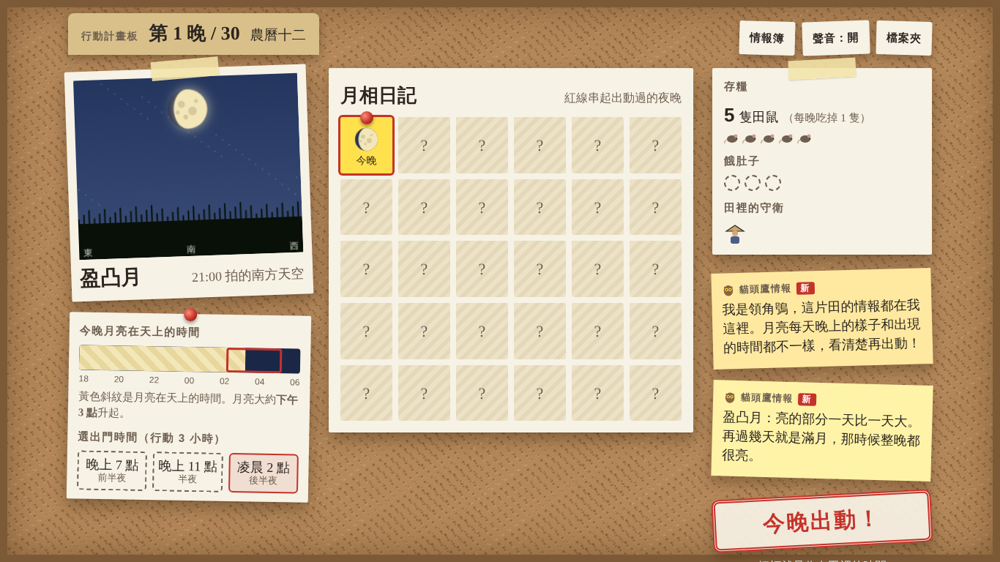
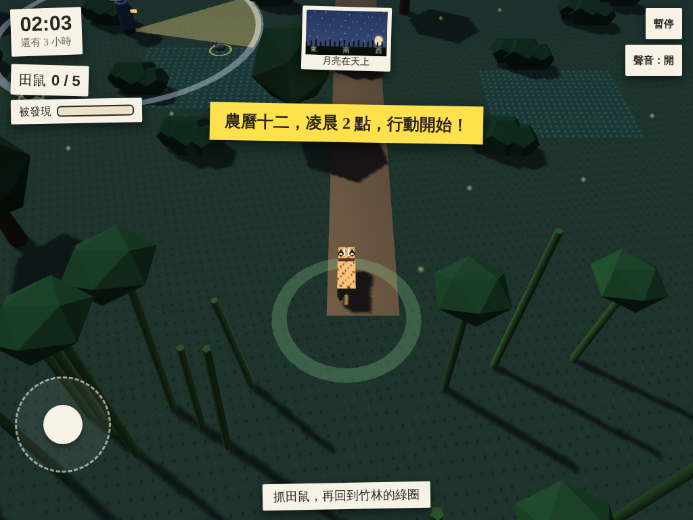
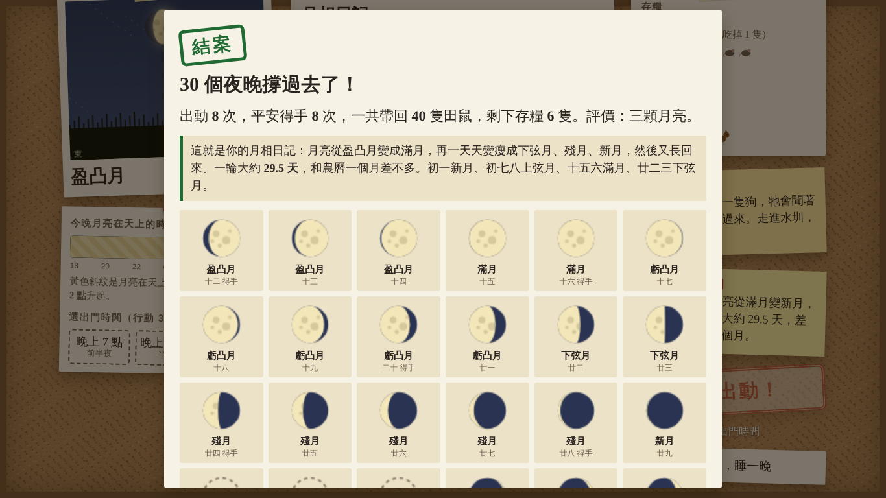

# 石虎月夜行 Leopard Cat Moon Night

一款以月相為核心玩法的 3D 夜間潛入遊戲，給臺灣國小四年級自然「月亮」單元使用。

學生扮演石虎媽媽，要帶著小石虎撐過 **30 個夜晚**。每天晚上先在**作戰計畫板**上看月亮、看月亮幾點升起，決定今晚出動還是躲起來睡；出動時要避開巡田農夫的手電筒、月光，還有循著氣味追來的狗，溜進田裡抓田鼠。

**線上遊玩：** https://prayer168.github.io/leopard-cat-moon-night/



## 怎麼玩

1. **計畫**：看今晚的月亮照片、月亮在天上的時間軸，選出門時間（晚上 7 點、晚上 11 點、凌晨 2 點）。
2. **行動**：3 個小時內抓田鼠、回到竹林。躲進草叢可以擋住月光；走進水圳可以甩掉狗。
3. **存糧**：每晚全家吃掉 1 隻田鼠。存糧吃光會餓肚子，餓 3 次行動失敗。
4. **結案**：撐過 30 晚後，月相日記就是一整個月的月亮變化。

操作：筆電用方向鍵或 W A S D；平板用左下角搖桿。



## 月相藏在玩法裡

這個遊戲不出題，也沒有說明面板。學生在玩的過程中會遇到：

| 學習內容 | 在遊戲裡的樣子 |
|---|---|
| 月相依序變化，一輪約 29.5 天 | 月相日記每晚自動貼上當晚的月亮，30 晚剛好一輪 |
| 月相與農曆日期 | 每晚標示農曆日期，貓頭鷹情報在初一、初八、十五、廿二等日子出現 |
| 臺灣看到的月亮：漸盈右亮、漸虧左亮 | 拍立得照片和月相日記都依北半球方向繪製 |
| 不同月相升起的時間不同 | 時間軸上的月亮亮條每晚往右移約 50 分鐘；月亮可能在行動中途升起或落下 |
| 月亮本身不發光 | 情報簿裡的「貓頭鷹祕密圖」可以拖曳月亮繞地球轉 |
| 月相不是地球影子造成的 | 祕密圖與情報說明 |

## 適用對象

- 國小四年級自然科「月亮」單元，對應 108 課綱
- 平板（iPad）、Chromebook、筆電開網址即可，不需登入、不收集個人資料
- 一個月的遊戲約 20 到 30 分鐘；進度存在學生自己的瀏覽器，可以分次玩



## 檔案結構

```
index.html          部署用的完整網頁（由 tools/build.sh 產生）
game.html           遊戲本體原始檔（也用於 Claude artifact）
notes.md            設計決定紀錄
HISTORY.md          開發歷程（YouTube 影片製作參考）
docs/prompt-v1.md   v1 提示詞（五關教材版）
docs/prompt-v2.md   v2 改版需求（遊戲版）
docs/screenshots/   截圖
tools/build.sh      由 game.html 產生 index.html
tools/check.js      JavaScript 語法與特殊字元檢查
tools/test.py       Playwright 截圖測試（筆電與平板三種尺寸）
tools/playtest.py   AI 自動試玩測試（11 個情境，錄影）
tools/report.py     由試玩結果產生測試報告
```

## 修改與部署

1. 修改 `game.html`
2. `node tools/check.js` 檢查語法
3. `sh tools/build.sh` 產生 `index.html`
4. （選用）`python3 tools/test.py` 截圖測試
5. commit 並 push；在 repo 的 Settings > Pages 選 main 分支即可上線

## 技術

- Three.js r128（cdnjs），單一 HTML 檔案
- 3D 模型、材質、配樂與音效都用程式產生，不使用外部素材
- 字型：霞鶩文楷 TC（手寫）、Noto Sans TC（印章與標籤）、Noto Serif TC（標題）

## 作者

陳賢宗（黑熊老師 Prayer），與 Claude 共同開發。

## 版本

- **v2.0.0**：改為一夜一夜推進的盜賊遊戲（目前版本）
- **v1.0.0**：五關月相教材版

詳見 [HISTORY.md](HISTORY.md)。
